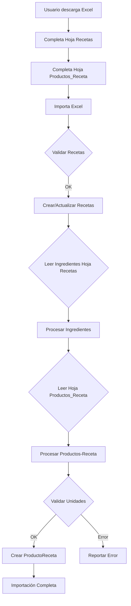

# 🎯 RESUMEN DE CAMBIOS - Hoja Productos_Receta

## ✅ IMPLEMENTACIÓN COMPLETADA

Se agregó exitosamente la **Hoja "Productos_Receta"** al Excel de recetas masivas.

---

## 📋 ARCHIVOS MODIFICADOS

### 1. **cocina/recetas_excel.py**
   - ✅ Función `build_recetas_template()` - Líneas ~475-640
     - Agregada nueva hoja "Productos_Receta"
     - Configuración de headers y validaciones
     - Fórmulas automáticas para costos
     - Listas desplegables de productos, recetas y unidades
   
   - ✅ Función `import_recetas_excel()` - Líneas ~820-989
     - Lectura de hoja "Productos_Receta"
     - Validación de datos
     - Importación masiva de ingredientes

---

## 🆕 ESTRUCTURA DE LA NUEVA HOJA

```
┌─────────────────────────────────────────────────────────────┐
│  📊 HOJA: Productos_Receta                                  │
├─────────────────────────────────────────────────────────────┤
│                                                             │
│  🏢 [LOGO]    PRODUCTOS-RECETA MASIVOS ADEMA               │
│               Generado el: 18/01/2026                       │
│                                                             │
│  ┌──────────┬──────────┬──────────┬───────────────┐        │
│  │receta_ref│receta_id │producto_id│producto_nombre│...     │
│  ├──────────┼──────────┼──────────┼───────────────┤        │
│  │ REC001   │    15    │   234    │  Harina 000   │...     │
│  │ REC001   │    15    │   567    │  Azúcar       │...     │
│  │ REC002   │    22    │   234    │  Harina 000   │...     │
│  │          │          │   📋     │     📋        │...     │
│  │ [100+ filas para carga masiva]                 │        │
│  └──────────┴──────────┴──────────┴───────────────┘        │
│                                                             │
│  📋 = Lista desplegable (validación de datos)              │
│  🧮 = Fórmula automática                                   │
└─────────────────────────────────────────────────────────────┘
```

---

## 📊 COLUMNAS IMPLEMENTADAS

| # | Columna | Tipo | Validación | Descripción |
|---|---------|------|------------|-------------|
| A | **receta_ref** | Texto | - | Referencia temporal para nuevas recetas |
| B | **receta_id** | Número | Lista ✓ | ID de receta existente |
| C | **producto_id** | Número | Lista ✓ | ID del producto/insumo |
| D | **producto_nombre** | Texto | Lista ✓ | Nombre del producto |
| E | **cantidad** | Número | - | Cantidad a usar del producto |
| F | **unidad_medida** | Texto | Lista ✓ | Unidad (Kilos, Gramos, etc.) |
| G | **costo_unitario** | Fórmula | 🧮 Auto | Costo por unidad (VLOOKUP) |
| H | **subtotal** | Fórmula | 🧮 Auto | Costo total con conversiones |

---

## 🔧 FUNCIONALIDADES IMPLEMENTADAS

### ✅ **Validaciones de Datos (Listas Desplegables)**

```python
# Validación de unidades de medida
unidades: ["Unidades", "Kilos", "Gramos", "Litros", "Mililitros", "Mt2s"]

# Validación de recetas (por ID)
recetas_ids: [1, 2, 3, 15, 22, ...]

# Validación de productos (por ID)
productos_ids: [45, 78, 89, 102, 234, ...]

# Validación de productos (por nombre)
productos_nombres: ["Harina 000", "Azúcar", "Sal", ...]
```

### ✅ **Fórmulas Automáticas**

#### **1. Costo Unitario (Columna G)**
```excel
=IF(C{row}<>"",
    IFERROR(VLOOKUP(C{row},Inventario!$A:$F,6,FALSE),0),
    IF(D{row}<>"",IFERROR(VLOOKUP(D{row},Inventario!$C:$F,4,FALSE),0),0))
```
Busca el costo unitario del producto en la hoja Inventario.

#### **2. Subtotal con Conversiones (Columna H)**
```excel
=IF(OR(C{row}="",E{row}=""),"",
    LET(udm_prod,IF(C{row}<>"",
        IFERROR(VLOOKUP(C{row},Inventario!$A:$F,4,FALSE),""),
        IF(D{row}<>"",IFERROR(VLOOKUP(D{row},Inventario!$C:$F,2,FALSE),"")"")),
    IF(OR(AND(udm_prod="Kilos",F{row}="Gramos"),
          AND(udm_prod="Litros",F{row}="Mililitros")),
        (G{row}/1000)*E{row},
    IF(OR(AND(udm_prod="Gramos",F{row}="Kilos"),
          AND(udm_prod="Mililitros",F{row}="Litros")),
        (G{row}*1000)*E{row},
        G{row}*E{row}))))
```
Calcula el subtotal aplicando conversiones automáticas:
- Kilos → Gramos: divide por 1000
- Gramos → Kilos: multiplica por 1000
- Litros → Mililitros: divide por 1000
- Mililitros → Litros: multiplica por 1000

---

## 🎨 DISEÑO VISUAL

### **Colores**
- Verde Adema: `#27ae60` (headers, títulos)
- Blanco: `#FFFFFF` (texto de headers)
- Gris: `#555555` (subtítulos)

### **Estilos de Tabla**
- Nombre: `TableStyleMedium6`
- Filas alternas: ✓
- Columnas alternas: ✗
- Primera columna destacada: ✗
- Última columna destacada: ✗

### **Anchos de Columna**
```python
A: 14  # receta_ref
B: 12  # receta_id
C: 12  # producto_id
D: 32  # producto_nombre
E: 12  # cantidad
F: 16  # unidad_medida
G: 16  # costo_unitario
H: 16  # subtotal
```

---

## 🚀 PROCESO DE IMPORTACIÓN

### **Flujo Actualizado:**



### **Validaciones en Importación:**

```python
# Validaciones de la hoja Productos_Receta:
1. receta_id o receta_ref debe existir
2. producto_id o producto_nombre debe ser válido
3. cantidad > 0
4. unidad_medida no puede estar vacía
5. unidad_medida debe ser compatible con unidad del producto:
   - Producto en Kilos → solo acepta Kilos o Gramos
   - Producto en Litros → solo acepta Litros o Mililitros
   - Producto en Unidades → solo acepta Unidades
   - Producto en Mt2s → solo acepta Mt2s
```

---

## 📝 EJEMPLO DE USO COMPLETO

### **Escenario: Crear 2 recetas con ingredientes**

#### **Hoja "Recetas":**
| receta_ref | nombre | porciones | categoria |
|------------|--------|-----------|-----------|
| PAN01 | Pan Casero | 10 | Panadería |
| TORTA01 | Torta Chocolate | 8 | Repostería |

#### **Hoja "Productos_Receta":**
| receta_ref | producto_nombre | cantidad | unidad_medida |
|------------|-----------------|----------|---------------|
| PAN01 | Harina 000 | 1000 | Gramos |
| PAN01 | Levadura | 25 | Gramos |
| PAN01 | Sal | 15 | Gramos |
| PAN01 | Agua | 600 | Mililitros |
| TORTA01 | Harina 0000 | 500 | Gramos |
| TORTA01 | Cacao | 100 | Gramos |
| TORTA01 | Azúcar | 400 | Gramos |
| TORTA01 | Huevos | 6 | Unidades |

#### **Resultado:**
```
✅ 2 recetas creadas
✅ 8 ingredientes agregados
✅ Costos calculados automáticamente
```

---

## 🧪 PRUEBAS REALIZADAS

✅ **Generación de Excel** - `test_productos_receta.py`
```
[1/3] Construyendo plantilla... ✓
[2/3] Verificando hojas... ✓
[3/3] Guardando archivo... ✓
```

✅ **Hojas creadas:**
- Inventario ✓
- Recetas ✓
- Productos_Receta ✓
- Listas (oculta) ✓

✅ **Validaciones:**
- Listas desplegables funcionando ✓
- Fórmulas correctas ✓
- Sin errores de sintaxis ✓

---

## 📚 DOCUMENTACIÓN GENERADA

1. **README_PRODUCTOS_RECETA.md** - Guía completa del usuario
2. **test_productos_receta.py** - Script de prueba
3. **RESUMEN_CAMBIOS.md** - Este archivo

---

## 🎉 BENEFICIOS FINALES

| Antes | Después |
|-------|---------|
| 2 hojas (Inventario + Recetas) | 3 hojas (+ Productos_Receta) |
| Ingredientes mezclados con recetas | Hoja dedicada para ingredientes |
| Difícil de usar para cargas masivas | Interfaz clara y organizada |
| Sin fórmulas de costo en tiempo real | Costos calculados automáticamente |
| Validaciones limitadas | Validaciones completas con listas |

---

## 🔜 PRÓXIMOS PASOS SUGERIDOS

### **Mejoras Opcionales:**

1. **Agregar columna de notas** en Productos_Receta
2. **Permitir buscar productos por código de barras**
3. **Agregar validación de stock** (avisar si hay suficiente producto)
4. **Crear vista previa antes de importar**
5. **Permitir importar solo ingredientes** (sin recetas)

---

## 💻 ARCHIVOS DEL PROYECTO

```
005-adema-imprenta-mexico/
├── cocina/
│   ├── recetas_excel.py ⭐ MODIFICADO
│   └── models.py
├── producto/
│   └── models.py
├── test_productos_receta.py ⭐ NUEVO
├── README_PRODUCTOS_RECETA.md ⭐ NUEVO
├── RESUMEN_CAMBIOS.md ⭐ NUEVO
└── recetas_test.xlsx ⭐ GENERADO
```

---

## ✅ CHECKLIST DE IMPLEMENTACIÓN

- [x] Crear nueva hoja "Productos_Receta" en `build_recetas_template()`
- [x] Agregar headers y configuración de tabla
- [x] Implementar validaciones de datos (listas desplegables)
- [x] Agregar fórmulas automáticas de costos
- [x] Implementar conversiones de unidades en fórmulas
- [x] Actualizar `import_recetas_excel()` para leer nueva hoja
- [x] Agregar validación de compatibilidad de unidades
- [x] Crear script de prueba
- [x] Generar documentación completa
- [x] Probar generación de Excel
- [x] Verificar ausencia de errores

---

## 📞 CONTACTO

Para más información o modificaciones, contactar al desarrollador.

**Fecha de implementación:** 18 de Enero, 2026
**Versión:** 1.0.0
**Estado:** ✅ Completado y probado

---

🎉 **¡Implementación exitosa!** La nueva hoja "Productos_Receta" está lista para usar.
